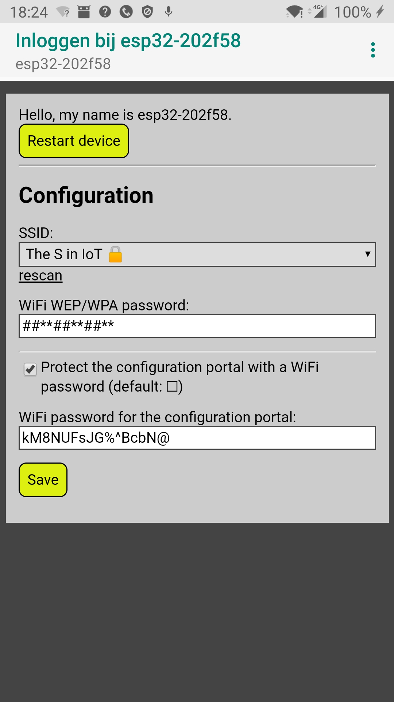
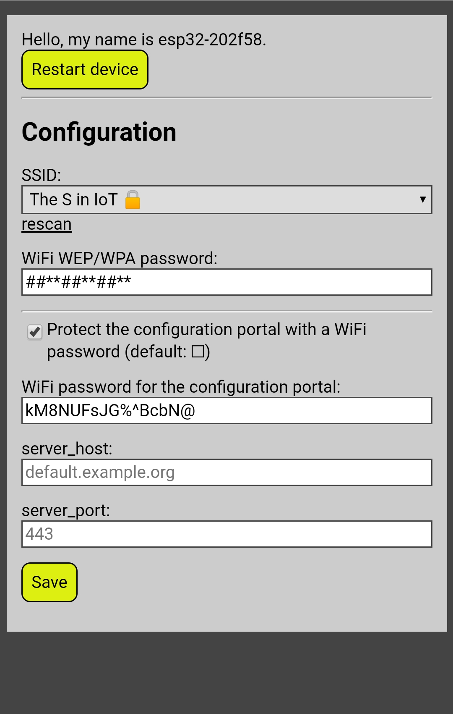
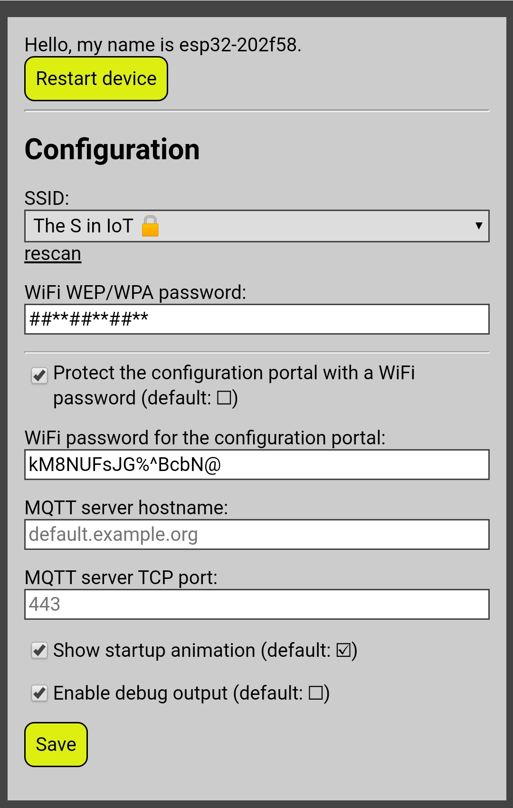

# WiFi configuration manager for the ESP32 and ESP8266 platforms in the Arduino framework

<p align=center>



</p>

<!--ts-->
   * [WiFi configuration manager for the ESP32 and ESP8266 platforms in the Arduino framework](#wifi-configuration-manager-for-the-esp32-and-esp8266-platforms-in-the-arduino-framework)
      * [Description](#description)
      * [Examples](#examples)
         * [Minimal usage](#minimal-usage)
         * [Callbacks and custom variables](#callbacks-and-custom-variables)
         * [Other examples](#other-examples)
         * [Note for ESP8266 users](#note-for-esp8266-users)
      * [Installing](#installing)
      * [Reference](#reference)
         * [Functions](#functions)
            * [WiFiSettings.connect([...])](#wifisettingsconnect)
            * [WiFiSettings.portal()](#wifisettingsportal)
            * [WiFiSettings.integer(...)](#wifisettingsinteger)
            * [WiFiSettings.string(...)](#wifisettingsstring)
            * [WiFiSettings.checkbox(...)](#wifisettingscheckbox)
            * [WiFiSettings.html(...)](#wifisettingshtml)
            * [WiFiSettings.heading(...)](#wifisettingsheading)
            * [WiFiSettings.warning(...)](#wifisettingswarning)
            * [WiFiSettings.info(...)](#wifisettingsinfo)
         * [Variables](#variables)
            * [WiFiSettings.hostname](#wifisettingshostname)
            * [WiFiSettings.password](#wifisettingspassword)
            * [WiFiSettings.secure](#wifisettingssecure)
            * [WiFiSettings.language](#wifisettingslanguage)
            * [WiFiSettings.on*](#wifisettingson)
      * [History](#history)
      * [A note about Hyrum's Law](#a-note-about-hyrums-law)

<!-- Added by: juerd, at: Tue 26 Jan 2021 04:37:05 AM CET -->

<!--te-->

## Description

This is a very simple, and somewhat naive, WiFi configuration manager for
ESP32 and ESP8266 programs written in the Arduino framework. It will allow you
to configure your WiFi network name (SSID) and password via a captive portal:
the ESP becomes an access point with a web based configuration page.

It was written for ease of use, not for extended functionality. For example,
restarting the microcontroller is the only way to leave the configuration
portal. A button to restart is provided in the web interface.

The library generates a random password to protect the portal with, but
it's only secured if you choose to do so by checking a checkbox. Of course,
the user can configure pick their own password.

The configuration is stored in files in the flash filesystem of the ESP. The
files are dumped in the root directory of the filesystem. Debug output
(including the password to the configuration portal) is written to `Serial`.

Only automatic IP address assignment (DHCP) is supported.

## Examples

### Minimal usage

```C++
#include <SPIFFS.h>
#include <WiFiSettings.h>

void setup() {
    Serial.begin(115200);
    SPIFFS.begin(true);  // On first run, will format after failing to mount

    WiFiSettings.connect();
}

void loop() {
    ...
}
```

### Callbacks and custom variables

```C++
void setup() {
    Serial.begin(115200);
    SPIFFS.begin(true);  // On first run, will format after failing to mount

    // Note that these examples call functions that you probably don't have.
    WiFiSettings.onSuccess  = []() { green(); };
    WiFiSettings.onFailure  = []() { red(); };
    WiFiSettings.onWaitLoop = []() { blue(); return 30; };  // delay 30 ms
    WiFiSettings.onPortalWaitLoop = []() { blink(); };

    String host = WiFiSettings.string( "server_host", "default.example.org");
    int    port = WiFiSettings.integer("server_port", 0, 65535, 443);

    WiFiSettings.connect(true, 30);
}
```

### Other examples

* The [ArduinoOTA example](examples/ArduinoOTA/ArduinoOTA.ino) shows how to
enable over-the-air uploads in the WiFiSettings configuration portal. If you
use the password from WiFiSettings as your OTA password, you no longer have
to hard code it!

### Note for ESP8266 users

The examples are written for ESP32. To use them with the older ESP8266 chip,
note that in the ESP8266 world, SPIFFS is deprecated and replaced by LittleFS.

WifiSettings uses SPIFFS on ESP32, and LittleFS on ESP8266.

Simply change both occurrences of `SPIFFS` to `LittleFS`, and remove `true` in
the call to `LittleFS.begin();`. LittleFS will format the filesystem by
default.

## Installing

Automated installation:
* [Instructions for Arduino Library Manager](https://www.arduino.cc/en/guide/libraries)
* [Instructions for PlatformIO Library Manager](https://platformio.org/lib/show/7251/esp32-WiFiSettings/installation)

Getting the source for manual installation:
* `git clone https://github.com/Juerd/ESP-WiFiSettings`
* [.zip and .tar.gz files](https://github.com/Juerd/ESP-WiFiSettings/releases)

## Reference

This library uses a singleton instance (object), `WiFiSettings`, and is not
designed to be inherited from (subclassed), or to have multiple instances.

### Functions

#### WiFiSettings.connect([...])

```C++
bool connect(bool portal = true, int wait_seconds = 30);
```

If no WiFi network is configured yet, starts the configuration portal.
In other cases, it will attempt to connect to the network in station (WiFi
client) mode, and wait until either a connection is established, or
`wait_seconds` has elapsed. Returns `true` if connection succeeded.

By default, a failed connection (no connection established within the timeout)
will cause the configuration portal to be started. Given `portal = false`, it
will instead return `false`.

To wait forever until WiFi is connected, use `wait_seconds = -1`. In this case,
the value of `portal` is ignored.

Calls the following callbacks:

* WiFiSettings.onConnect
* WiFiSettings.onWaitLoop -> int (milliseconds to wait)
* WiFiSettings.onSuccess
* WiFiSettings.onFailure

#### WiFiSettings.portal()

```C++
void portal();
```

Disconnects any active WiFi and turns the ESP into a captive portal with a
DNS server that works on every hostname.

Normally, this function is called by `.connect()`. To allow reconfiguration
after the initial configuration, you could call `.portal()` manually, for
example when a button is pressed during startup.

This function never ends. A restart is required to resume normal operation.

Calls the following callbacks:

* WiFiSettings.onPortal
* WiFiSettings.onPortalWaitLoop
* WiFiSettings.onPortalView
* WiFiSettings.onUserAgent(String& ua)
* WiFiSettings.onConfigSaved
* WiFiSettings.onRestart

#### WiFiSettings.integer(...)
#### WiFiSettings.string(...)
#### WiFiSettings.checkbox(...)

```C++
int integer(String name, [long min, long max,] int init = 0, String label = name);
String string(String name, [[unsigned int min_length,] unsigned int max_length,] String init = "", String label = name);
bool checkbox(String name, bool init = false, String label = name);
```

Configures a custom configurable option and returns the current value. When no
value (or an empty string) is configured, the value given as `init` is returned.

These functions should be called *before* calling `.connect()` or `.portal()`.

The `name` is used as the filename in the SPIFFS, and as an HTML form element
name, and must be valid in both of those contexts. Any given `name` should only
be used once!

It is strongly suggested to include the name of a project in the `name` of the
configuration option, if it is specific to that project. For example, an MQTT
topic is probably specific to the application, while the server hostname
is likely to be shared among several projects. This helps when the ESP is
later reused for different applications.

Optionally, `label` can be specified as a descriptive text to use on the
configuration portal.

Some restrictions for the values can be given. Note that these limitations are
implemented on the client side, and may not be respected by browsers. For
integers, a range can be specified by supplying both `min` and `max`. For
strings, a maximum length can be specified as `max_length`. A minimum string
length can be set with `min_length`, effectively making the field mandatory:
it can no longer be left empty to get the `init` value.

#### WiFiSettings.html(...)
#### WiFiSettings.heading(...)
#### WiFiSettings.warning(...)
#### WiFiSettings.info(...)

```C++
void html(String tag, String contents, bool escape = true);
void heading(String contents, bool escape = true);
void warning(String contents, bool escape = true);
void info(String contents, bool escape = true);
```

Mix in custom text or HTML fragments, such as headings, warning texts, or info
texts.

Custom HTML can be specified with the `html` function, which takes a tag (e.g.
`"p"`) or a tag with attributes (e.g. `"p align=right"`) as the first argument.
Only tags that take a closing tag should be used. The other functions are
provided for convenience.

The contents are safely escaped by default, but raw HTML can be added by
providing `false` as the last argument, in which case the contents are added to
the page without any verification or modification. Consider the security
implications of using unescaped data from external sources.

### Variables

Note: because of the way this library is designed, any assignment to the
member variables should be done *before* calling any of the functions.

#### WiFiSettings.hostname

```C++
String
```

Name to use as the hostname and SSID for the access point. By default, this is
set to "esp32-" or "esp8266-", depending on the platform.

If it ends in a `-` character, a unique 6 digit device identifier
(specifically, the hexadecimal representation of the device interface specific
part of the ESP's MAC address, in reverse byte order) is added automatically.
This is highly recommended.

Use only ASCII digits and letters. ASCII hyphens (`-`) can only be used in
between other characters (i.e. not two in a row, and not as the first
character). Most characters, including underscores (`_`) and spaces, are not
valid in hostnames.

#### WiFiSettings.password

```C++
String
```

This variable is used to protect the configuration portal's softAP. When no
password is explicitly assigned before the first custom configuration parameter
is defined (with `.string`, `.integer`, or `.checkbox`), a password will be
automatically generated and can be configured by the user.

It's strongly recommended to leave this variable untouched, and use the
built-in password generation feature, and letting the user configure their own
password, instead of "hard coding" a password.

The password has no effect unless the portal is secured; see `.secure`.

#### WiFiSettings.secure

```C++
bool
```

By setting this to `true`, before any custom configuration parameter is defined
with `.string`, `.integer`, or `.checkbox`, secure mode will be forced, instead
of the default behavior, which is to initially use an insecure softAP and to
let the user decide whether to secure it.

When `.secure` is left in the default state, `false`, the user setting will be
used.

When forcing secure mode, it is still recommended to leave `.password` unset so
that a password is automatically generated, if you have a way to communicate it
to the user, for example with an LCD display, or
`Serial.println(WiFiSettings.password);`. Having hard coded password literals
in source code is generally considered a bad idea, because that makes it harder
to share the code with others.

#### WiFiSettings.language

```C++
String
```

The language to be used in the WiFiSettings portal. Currently supported are
`en` and `nl`. Once the user has picked a language in the portal, the user
setting overrides any value previously assigned. This variable is updated to
reflect the currently selected language.

By default, all available languages are available. To conserve flash storage
space, it is possible to select only specific languages, by specifying build
flags such as `LANGUAGE_EN`. If only a single language is defined, this
language will be used regardless of any configuration, and no language
drop-down is presented to the user. Note: build flags are not available in the
Arduino IDE, but can be specified in Arduino board files. In PlatformIO, build
flags can be specified in the `[env]` section, e.g. `build_flags =
-DLANGUAGE_EN`.

*If you wish to contribute a translation, please refer to
`WiFiSettings_strings.h`. (Note: due to storage constraints on microcontroller
flash filesystems, only widely used natural languages will be included.)*

#### WiFiSettings.on*

The callback functions are mentioned in the documentation for the respective
functions that call them.

## History

Note that this library was briefly named WiFiConfig, but was renamed to
WiFiSettings because there was already another library called
[WiFiConfig](https://github.com/snakeye/WifiConfig).

From version 3.0.0, based on a contribution by Reinier van der Leer, this
library also supports the older ESP8266, and the repository was renamed from
esp32-WiFiSettings to ESP-WiFiSettings.

## A note about Hyrum's Law

It is said that *all observable behaviors of your system will be depended on by
somebody*, and you are of course free to explore the source and use any
unintended feature you may find to your advantage. Bear in mind, however, that
depending on any behavior that is not documented here, is more likely to cause
breakage when you install a newer version of this library. The author feels no
obligation to keep backwards compatibility with undocumented features :)
